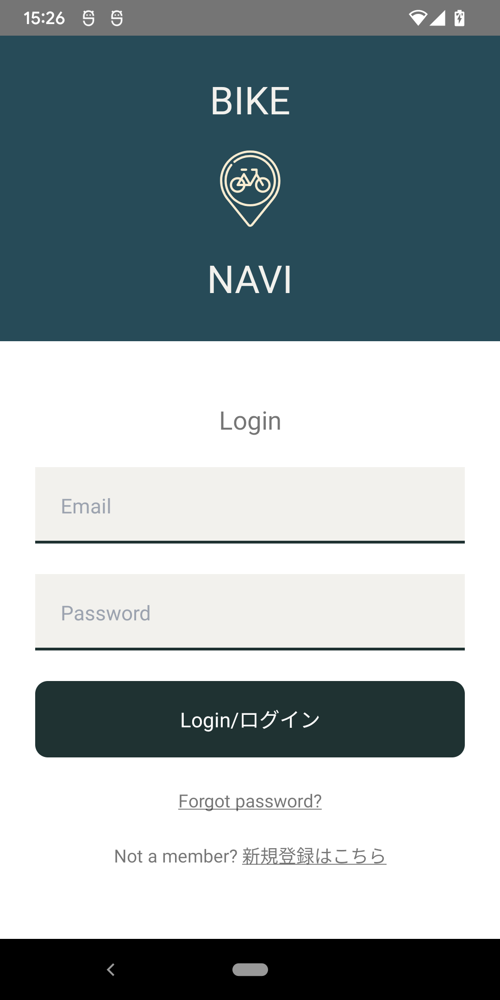
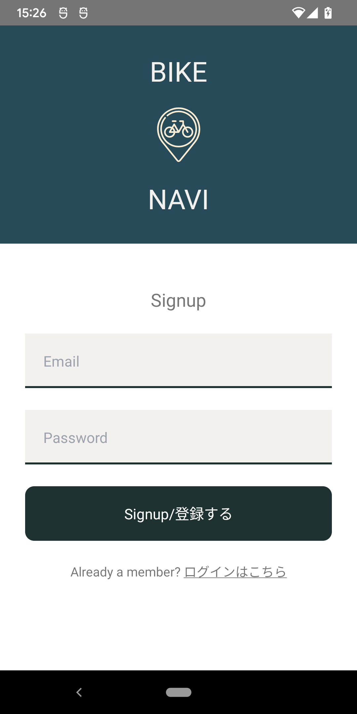
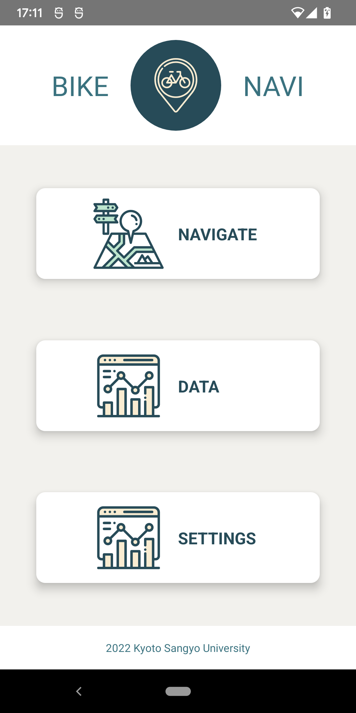
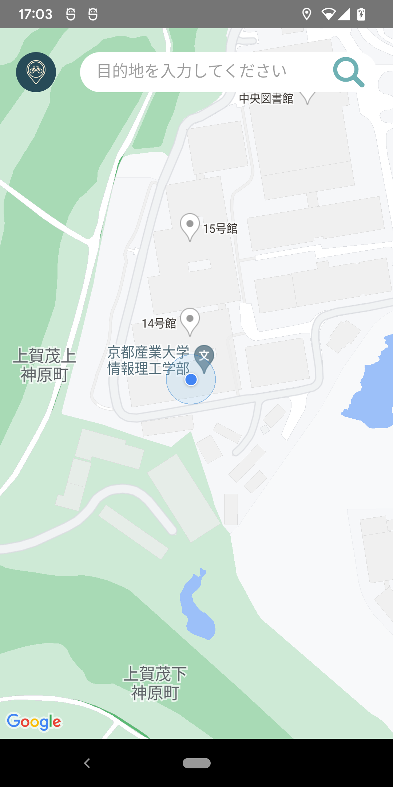
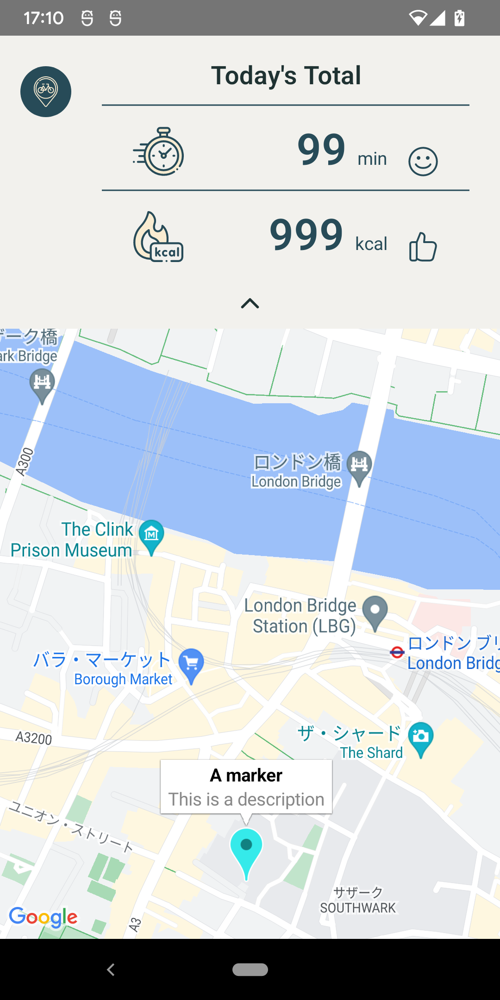
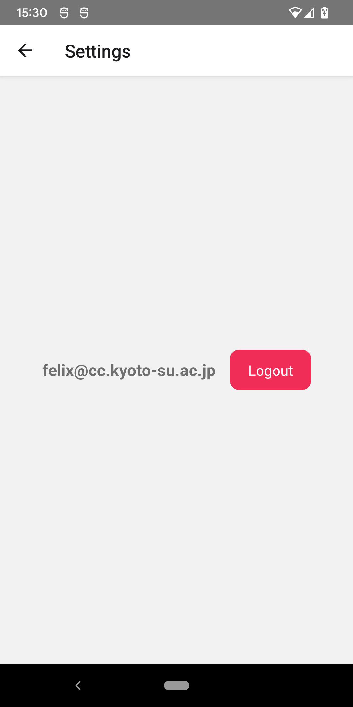

# MAAS application

Using react-native with the react-native command line.

## Execute

To run on an Android device you need to execute:

```
npx react-native run-android
```

To run on an iOS device you need to run:

```
npx react-native run-ios
```

To make this easier, there is a Makefile.

The commands then are `make android` and `make ios` respectively.

Before you build for iOS the first time you need to install dependencies:

```
cd ios
pod install
```

Add the Google API key for maps to work in the following files:
- android/app/src/main/AndroidManifest.xml
- src/MapScreen.tsx
- ios/expoMaasNative/AppDelegate.mm


### TODO:

- space at top on iphone is to little (icon is hidden behind camera)

## Firebase

- https://docs.expo.dev/guides/using-firebase/

## Google Maps
- https://github.com/react-native-maps/react-native-maps
- https://blog.logrocket.com/react-native-maps-introduction/
- https://docs.expo.dev/versions/latest/sdk/map-view/
- https://admshng.medium.com/how-to-integrate-google-maps-into-react-native-via-expo-2021-9e45f79e2f7b

## Use tensorflow for camera processing

- https://github.com/expo/examples/tree/master/with-tfjs-camera
- https://dev.to/lankinen/setup-tensorflow-js-to-react-native-expo-project-2110

### Screenshots







